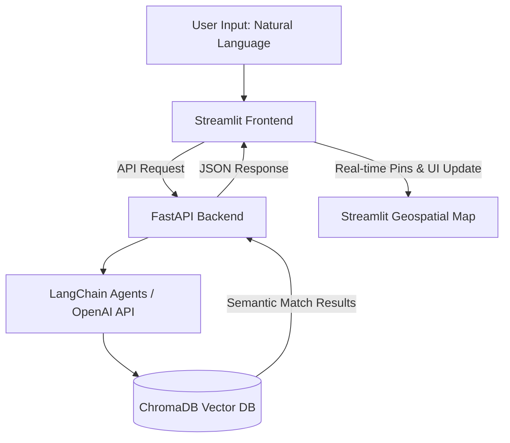

# SmartBnB

SmartBnB: AI-powered Airbnb recommendations that get you, just in a chat.

SmartBnB is an AI-powered recommendation system designed to redefine how users search for vacation rentals. Moving away from rigid traditional filters, SmartBnB leverages Large Language Models (LLMs) and Vector Databases to interpret complex, natural language requests and match them with the perfect Airbnb listings.
Featuring a modern, immersive user interface built with Streamlit, the application embeds a sleek, floating AI chat assistant directly over an interactive, full-screen geospatial map.

---

## 🚀 Key Features

* **Natural Language Property Search:** Forget about endless clicking. Just type what you need in plain English (e.g., *"A quiet apartment in Roma Norte with high-speed internet for remote work and a pet-friendly balcony"*) and let the LLM handle the rest.
* **Semantic & Vector Retrieval:** Uses a specialized embedding pipeline with **ChromaDB** to search through Airbnb datasets, ensuring results are matched by contextual relevance, reviews, and amenities rather than strict keyword constraints.
* **Immersive Floating Chat & Geospatial UI:** A premium, single-page frontend where a floating glassmorphic chat container sits on top of a dynamic, interactive geospatial map, updating real-time property pins as the conversation flows.
* **AI-Generated Match Summaries:** Instead of reading through hundreds of user reviews, the system provides a tailored *"Why you'll love it"* summary custom-generated for your specific query using AI agents.

---

## 🏗️ System Architecture

The following diagram illustrates how your natural language prompt is processed through the backend API to render real-time recommendations on the interactive geospatial map:

---

## 🗺️ Product Roadmap & Upcoming Updates

SmartBnB is continuously evolving. Here is what we are working on next. Drop a ⭐ to stay notified about these upcoming releases!

- [ ] **Multimodal Search (Next Release):** Allow users to upload an image (e.g., a screenshot of a living room style they love) alongside their text query to find matching Airbnbs.
- [ ] **Live Price & Availability Sync:** Integrate dynamic scheduling filters to match the database updates with real-time room availability.
- [ ] **User Authentication & Saved Trips:** Save your AI conversations, favorite listings, and custom map views.
- [ ] **Advanced Agentic Reasoning:** Implement LangGraph to handle complex multi-turn negotiations and cross-referencing for group trips.

---

## 🤝 Contributing

We love open-source! Whether you want to fix a bug, optimize the ChromaDB indexing pipeline, or suggest a new feature for the Streamlit UI, your contributions are welcome.

1. Fork the Project.
2. Create your Feature Branch (`git checkout -b feature/AmazingFeature`).
3. Commit your Changes (`git commit -m 'Add some AmazingFeature'`).
4. Push to the Branch (`git push origin feature/AmazingFeature`).
5. Open a Pull Request.

---

## 🌟 Support & Stay Tuned

If you find this project useful, inspiring, or if you are just excited about the future of AI-driven travel search:

* **Give us a ⭐ Star** at the top right of this page to save it in your dashboard and follow our progress.
* **Watch the repository** to receive automated notifications whenever we push big feature updates.
